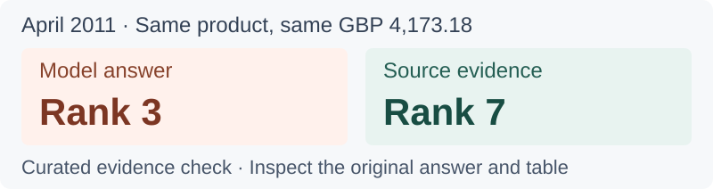
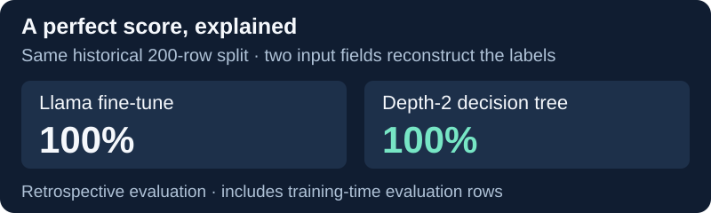

# Yuchi Wang

I'm an MS student in Business Analytics and Artificial Intelligence at **Johns Hopkins Carey Business School** (expected August 2027). I graduated **cum laude from Ohio State**, with a background in accounting and logistics management.

My projects examine the reliability of AI in business analytics: how data definitions shape results, whether model evaluations are meaningful, and whether business claims are supported by evidence.

Washington, DC · [Email](mailto:yuchiwang02@outlook.com) · [Hugging Face](https://huggingface.co/Yuchiwang02)

## Selected projects

### BizHallu · Checking AI-generated business claims

A correct amount can still support an incorrect claim. In one retail example, an LLM copies the right product and amount but assigns it third place; the evidence places it seventh.

The workflow connects retail transactions, 100 reproducible business questions, computed reference answers, and local model responses. Interactive cases make the errors inspectable. The evaluation uses provisional, AI-assisted span labels without independent human annotation; the featured case is a curated evidence check.

[Explore a case](https://yuchi-wang02.github.io/bizhallu/portfolio_demo_v2.html?case=q_0064) · [Methods and results](https://yuchi-wang02.github.io/bizhallu/detector_interpretation.html) · [Code](https://github.com/Yuchi-Wang02/bizhallu)

### DelaySentinel · Investigating a misleading perfect score

A published logistics fine-tune scored 100% on its original 200-row split. A depth-2 decision tree matched it: the synthetic table's label was fully determined by two input fields.

The retrospective audit traces label leakage and probes model behavior. That split is not a clean independent test set. A separate study uses classical models on real Olist orders to explore a more realistic prediction task.

[Read the case study](https://github.com/Yuchi-Wang02/delaysentinel/blob/main/docs/case_study.md) · [Inspect the results](https://github.com/Yuchi-Wang02/delaysentinel/tree/main/results) · [Model card](https://huggingface.co/Yuchiwang02/Llama-3.2-1B-DelaySentinel)

## Background

Experience includes social intelligence analytics at **Ipsos in Shanghai**, supply chain analysis at **SF Express**, and work as a **Peer Advisor at Ohio State's Office of International Affairs**, supporting international students.

**Project stack:** Python, pandas, scikit-learn, PyTorch, Hugging Face Transformers, pytest, and GitHub Actions.

These personal projects use AI-assisted implementation and review. Each repository documents its methods, evidence, and limitations.
